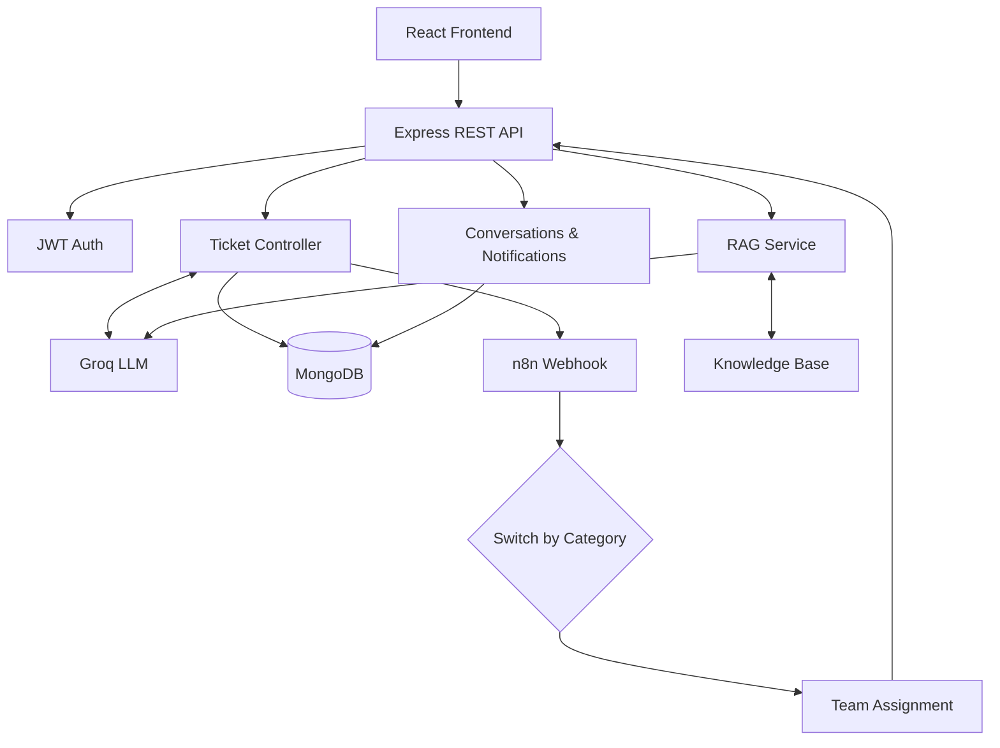
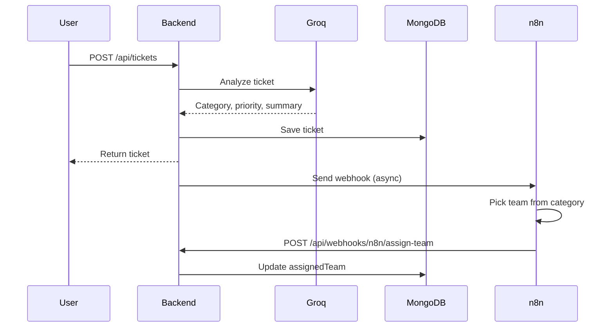
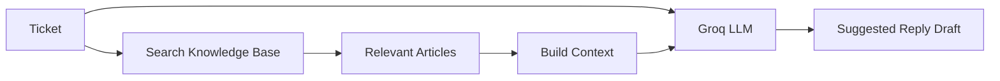
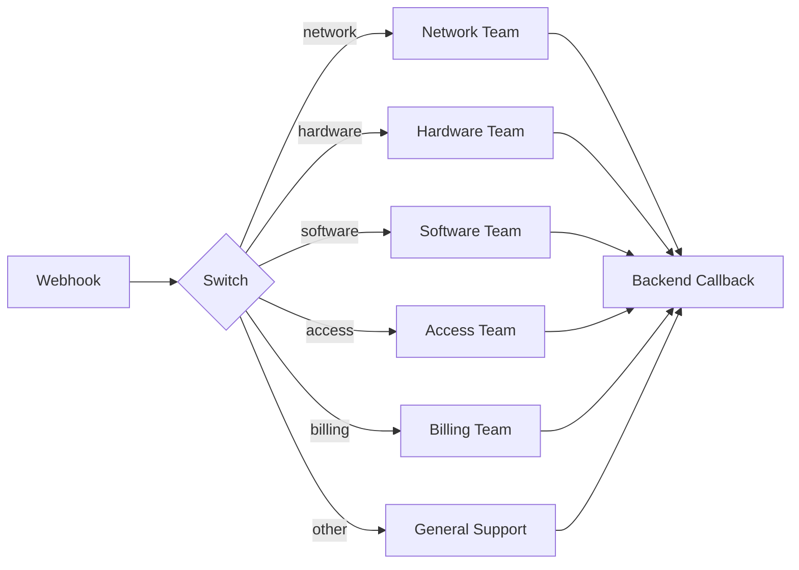

<div align="center">

# 🎧 Deskline

### Intelligent IT Helpdesk & Automation Platform

AI-driven ticket triage · RAG-powered replies · Event-driven routing · SLA monitoring


</div>

---

## 📖 Overview

Deskline is a full-stack **MERN** helpdesk that combines Generative AI with workflow automation to cut down manual ticket handling.

When a ticket is submitted, Deskline:

1. Classifies it with an LLM (category, priority, summary, confidence, reason)
2. Saves it to MongoDB
3. Triggers an **n8n** workflow that routes it to the right support team
4. Gives agents **knowledge-grounded AI reply suggestions** via RAG
5. Keeps users and agents in sync with ticket conversations and notifications

```text
Before:  Manual review → Manual classification → Manual assignment → Manual troubleshooting
Now:     Ticket → AI triage → Automated routing → RAG-assisted replies → Resolution
```

---

## 📸 Screenshots
<p align="center">
  <b>n8n Routing Workflow</b><br>
  
</p>

---

## ✨ Features

| Feature | Description |
|---|---|
| 🤖 **AI Triage** | LLM assigns category, priority, summary, confidence score, and reasoning. Falls back to defaults if the AI service is down. |
| 🔄 **Automated Routing** | Backend fires a webhook to n8n, which maps the category to a team and calls back to assign it. |
| 🧠 **RAG Suggested Replies** | Relevant knowledge-base articles are retrieved and passed to the LLM as context. Replies are drafts for staff to review. |
| 💬 **Ticket Conversations** | Threaded replies between users and support, with automatic status transitions. |
| 🔔 **Notifications** | Persistent, per-user notifications stored in MongoDB (polling-based). |
| ⏱️ **SLA Monitoring** | Priority-based thresholds with breach detection. |
| 📊 **Analytics & Filtering** | Category analytics; filter by status, priority, category, team, or agent. |
| 🔐 **RBAC** | JWT auth with User, Agent, Team Lead, and Admin roles plus team-level access. |

**AI triage example**

```text
Ticket:    "WiFi is not working on my laptop."

Category   → Network
Priority   → High
Summary    → User is unable to connect to the office WiFi.
Confidence → 0.94
Reason     → The issue is related to network connectivity.
```

**Categories:** Hardware · Software · Network · Access · Billing · Other
**Priorities:** Low · Medium · High · Urgent

### Category → Team Routing

| Category | Team |
|---|---|
| Network | Network Team |
| Hardware | Hardware Team |
| Software | Software Team |
| Access | Access Team |
| Billing | Billing Team |
| Other | General Support |

### SLA Thresholds

| Priority | Threshold |
|---|---:|
| Urgent | 2 hours |
| High | 4 hours |
| Medium | 24 hours |
| Low | 72 hours |

Resolved and closed tickets are excluded from breach calculations.

### Roles

| Role | Capabilities |
|---|---|
| **User** | Create and track own tickets, reply, receive notifications |
| **Agent** | View team tickets, reply, update status/priority, assign, resolve, generate AI replies |
| **Team Lead** | Everything an agent can do, plus team workload monitoring and assigning tickets to agents |
| **Admin** | View all tickets, manage users and teams, system-wide analytics, delete tickets |

> Agents and Team Leads cannot access tickets belonging to other teams.

### Ticket Status Flow

```text
open / in-progress ──(agent replies)──▶ waiting-for-user
waiting-for-user   ──(user replies)───▶ in-progress
in-progress        ──(resolution)─────▶ resolved ──▶ closed
```

A user reply on a resolved ticket reopens it. Closed tickets reject further replies.

---

## 🏗️ Architecture



### Ticket Creation Flow



### RAG Pipeline



---

## 🛠️ Tech Stack

| Layer | Technologies |
|---|---|
| **Frontend** | React, React Router, Vite, Axios, CSS |
| **Backend** | Node.js, Express, Mongoose, JWT, bcryptjs |
| **Database** | MongoDB / MongoDB Atlas |
| **AI** | Groq API (`openai/gpt-oss-120b`), RAG |
| **Automation** | n8n |

---

## 📁 Project Structure

```text
AI-Helpdesk-System/
├── backend/
│   ├── config/
│   ├── controllers/     # auth, ticket, comment, notification, ai
│   ├── middleware/      # auth, asyncHandler, errorHandler
│   ├── models/          # User, Team, Ticket, TicketComment, Notification, KnowledgeBase
│   ├── routes/
│   ├── services/        # groqService, ragService
│   ├── seed.js
│   └── server.js
├── frontend/
│   └── src/
│       ├── components/  # Navbar, TicketCard, SearchFilterBar, CategoryAnalytics, ...
│       ├── context/     # AuthContext, ConfirmContext
│       ├── pages/       # dashboards, TicketDetail, KnowledgeBase, ManageUsers, ...
│       └── utils/api.js
├── screenshots/
└── README.md
```

---

## 🔌 REST API

| Method | Endpoint | Description |
|---|---|---|
| POST | `/api/auth/signup` | Register a user |
| POST | `/api/auth/login` | Log in |
| GET | `/api/auth/me` | Current user |
| POST | `/api/tickets` | Create ticket |
| GET | `/api/tickets` | List accessible tickets |
| GET | `/api/tickets/:id` | Ticket details |
| PUT | `/api/tickets/:id` | Update ticket |
| DELETE | `/api/tickets/:id` | Delete ticket |
| GET | `/api/tickets/breached` | SLA-breached tickets |
| GET | `/api/tickets/:id/comments` | Get conversation |
| POST | `/api/tickets/:id/comments` | Add reply |
| POST | `/api/tickets/:id/suggest-reply` | Generate AI reply (RAG) |
| POST | `/api/webhooks/n8n/assign-team` | n8n callback (requires `x-api-key`) |

---

## 🚀 Getting Started

### Prerequisites

- Node.js 20+ and npm 10+
- MongoDB Atlas account (or local MongoDB)
- [Groq API key](https://console.groq.com)
- n8n (run via `npx n8n`)

### 1. Clone and install

```bash
git clone <your-repository-url>
cd AI-Helpdesk-System

cd backend && npm install
cd ../frontend && npm install
```

### 2. Configure environment variables

**`backend/.env`**

```env
PORT=5000
MONGO_URI=mongodb+srv://<username>:<password>@cluster.mongodb.net/helpdesk

JWT_SECRET=your_super_secret_jwt_string
JWT_EXPIRES_IN=7d

CLIENT_URL=http://localhost:5173
GROQ_API_KEY=your_groq_api_key

N8N_API_KEY=your_secure_webhook_key
N8N_WEBHOOK_URL=http://localhost:5678/webhook/ticket-created
```

**`frontend/.env`**

```env
VITE_API_URL=http://localhost:5000/api
```

> Write values without spaces around `=` (use `PORT=5000`, not `PORT = 5000`).
> If using Atlas, add your IP under **Network Access**.

### 3. Seed the database

```bash
cd backend
node seed.js
```

Creates teams, agents, team leads, sample tickets, and knowledge-base articles.

<details>
<summary><b>Seeded development accounts</b></summary>

| Role | Email | Password |
|---|---|---|
| Team Lead | `network.lead@deskline.com` (also `hardware`, `software`, `access`, `billing`, `general`) | `lead123` |
| Agent | `ravi.agent@deskline.com` (also `ananya`, `farhan`, `neha`, `arjun`, `simran`) | `agent123` |

> For local development and testing only.

</details>

### 4. Run the three services

Use a separate terminal for each:

| Service | Command | URL |
|---|---|---|
| Backend | `cd backend && npm run dev` | http://localhost:5000 |
| Frontend | `cd frontend && npm run dev` | http://localhost:5173 |
| n8n | `npx n8n` | http://localhost:5678 |

---

## ⚙️ n8n Workflow Setup

Build the workflow in n8n with three parts.

**1. Webhook node**

| Setting | Value |
|---|---|
| Method | `POST` |
| Path | `ticket-created` |

The resulting URL must match `N8N_WEBHOOK_URL`.

**2. Switch node**

- Value: `{{ $json.body.category }}`
- Cases: `network`, `hardware`, `software`, `access`, `billing`, `other`

**3. HTTP Request node** (one per branch)

| Setting | Value |
|---|---|
| Method | `POST` |
| URL | `http://localhost:5000/api/webhooks/n8n/assign-team` |
| Header | `x-api-key: <your N8N_API_KEY>` |

Body (change `teamName` per branch):

```json
{
  "ticketId": "{{ $json.body.id }}",
  "teamName": "Network Team"
}
```

> ⚠️ Do **not** prefix the expression with `=` (`"={{ $json.body.id }}"`). It produces an invalid MongoDB ticket ID.



---

## 🧪 Quick Test

1. Open http://localhost:5173 and log in with a seeded account.
2. Create a ticket, e.g. *"WiFi is not working — my laptop cannot connect to the office WiFi."*
3. Confirm the ticket shows AI category, priority, summary, confidence, and reason.
4. Check n8n at http://localhost:5678 for a successful execution.
5. Confirm `assignedTeam` is set (e.g. **Network Team**).
6. Log in as an agent on that team, open the ticket, and reply.
7. Confirm the user receives a notification, then reply as the user.
8. Click **Suggest Reply** to test RAG.
9. Add a resolution, resolve the ticket, then close it. Further replies should be rejected.

---

## 🛑 Troubleshooting

| Problem | What to check |
|---|---|
| **MongoDB connection error** | URI, username, password, and database name are correct; your IP is allowed in Atlas; the cluster is running. |
| **Groq API error** | `GROQ_API_KEY` is set and the model is `openai/gpt-oss-120b`. |
| **Frontend can't reach backend** | `VITE_API_URL=http://localhost:5000/api` and the backend is running. |
| **n8n webhook not triggering** | n8n is running, workflow is **active**, path is `ticket-created`, method is `POST`, port `5678` is reachable. |
| **Team not assigned** | n8n execution succeeded; Switch expression is `{{ $json.body.category }}`; team name matches the seeded team exactly; callback URL is correct; `x-api-key` matches `N8N_API_KEY`. |
| **Invalid ticket ID** | Remove the leading `=` from the `ticketId` expression. |

---

## 🔒 Security Notes

- Never commit `backend/.env`, `frontend/.env`, or `node_modules/`.
- Never hard-code API keys in React components, controllers, services, or committed n8n workflow files.
- Passwords are hashed with `bcryptjs`; the n8n callback is protected by an API key.

---

## 🗺️ Roadmap

**Implemented:** JWT + RBAC · four role dashboards · AI triage · n8n routing · team-level authorization · conversations · notifications · knowledge base · RAG replies · SLA monitoring · analytics · filtering · seed data

**Planned**

- [ ] WebSocket real-time notifications
- [ ] Email, Slack, and Microsoft Teams integration
- [ ] Vector DB / embedding-based RAG
- [ ] Automated ticket resolution
- [ ] File attachments
- [ ] Audit logging
- [ ] Agent performance and advanced SLA dashboards
- [ ] Customer satisfaction tracking
- [ ] Docker and CI/CD

---

## 📄 License

Developed for **educational, portfolio, and demonstration purposes**.

<div align="center">

**Deskline** — Intelligent IT Support. Automated Routing. Knowledge-Grounded Assistance.

</div>